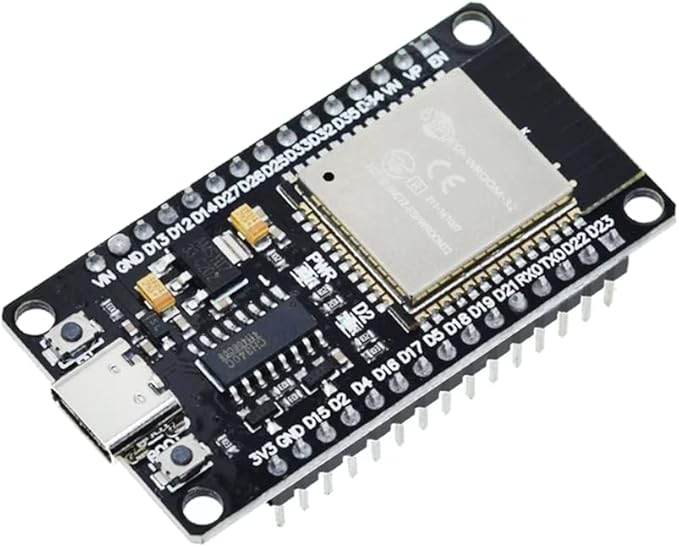

# 制御システム部２G　2024年度インターン（ソフト編）

本カリキュラムの目的

- IoT・電子工作を身近なものとして感じる
- プログラミングをして、自分の思った通りにモノを動かす
- IoTを活用した未来に思いをはせる

## IoTって何？

"Internet of Things"の頭文字で、
従来はインターネットに接続していなかった様々なデバイスが、
ネットワークを通じてサーバーやクラウドに接続されて、情報交換をする仕組みを指します。

デバイスと一口にいっても、様々なものが現在では接続されています。

- センサー機器
- 駆動装置（アクチュエーター）
- 建機
- 住宅・建物
- 車
- 家電製品
- 電子機器

デバイスからクラウドに送信された情報を分析したり、クラウドからデバイスに情報を送信して挙動を変えたり、
デバイスでは容量が足りない処理をクラウド上のAIで実行したり、様々な事例が生まれています。

## 建機とIoT

建機とデータを送受信できるとどんないいことがあるか考えてみよう

発展中の分野なので、様々なアイデアが生まれています。自分なりの答えを考えてみましょう。

- データを集められると何に使えるでしょう？
- データを建機に送れると何に使えるでしょう？
- データを欲しがっているのは誰でしょう？

IoTでは、データを収集すること以上に、データを活用することが大切です。ただし、データがないと活用することも出来ません。

今回の実習では、データを収集することにまずは着目しましょう。

## ESP32とは

今回は、ESP-WROOM-32(ESP32)を使ってIoTの基本を勉強します。

"ESP32"は上海のEspressif Systems社が開発し台湾のTSMCが製造する、Wi-FiとBluetoothを搭載したSoCマイクロコントローラです。
動作温度が-40℃から＋125℃まで安定した動作が可能で、超低消費電力設計で、多様な機能を実装した安価な製品で、IoTギークに大人気な製品です。

似たような用途で、ArduinoやRaspberry Piといったものが存在するので、興味があれば調べてみましょう。

勘違いの内容に書いておくと、加藤製作所の建機がESP32で動いているわけではありません。

以下に今回の実習で必要なESP32の機能、PINの働き、制約などをまとめたので、都度参照してください。

[ESP32リファレンス](esp32_doc/ReadMe.md)

## 実習準備

### 実習に必要なツール・ファームなど

シリアルドライバイアは、接続した際にCOMポートに表示がされない場合にインストールしてください。（WindosではCOM、Macでは/dev/tty.*を確認）

- [Thonny](https://thonny.org/) Python IDE for beginners
- [FirmWare](https://micropython.org/download/ESP32_GENERIC/) ESP32 MicroPython FirmWare
- [CH340 Serial Driver](esp32_doc/CH341SER.zip) シリアル接続ドライバ

※シリアルドライバは、開発ボードの実装メーカーによって異なるので要注意です。オフィシャルサイトにも別のドライバのリンクが張られているので、マウントできなければこちらを試してください。

[Establish Serial Connection with ESP32](https://docs.espressif.com/projects/esp-idf/en/stable/esp32/get-started/establish-serial-connection.html)

### 利用するデバイス

サンプルプログラムでは、以下のデバイスを想定しています。

- [開発ボード ESP32 ESP-WROOM-32 WiFi Bluetooth (USB Type-C)](https://www.amazon.co.jp/gp/product/B0C1444DRX/ref=ppx_yo_dt_b_asin_title_o03_s00?ie=UTF8&th=1)
- [IRヒューマンセンサーAM312](https://www.amazon.co.jp/gp/product/B084VMYMFZ/ref=ppx_yo_dt_b_asin_title_o02_s00?ie=UTF8&th=1)
- ブレッドボード（ESP32-Devの幅が独特なので、通常の５穴のボードであれば２枚必要）
- LED（3.3Vで駆動する任意のLED１個）
- 抵抗器（3.3V電圧に応じたLEDに対する抵抗１個）
- ジャンパー線数本

### 開発環境のセットアップとESP32へのファームウエアの書き込み

次のページに手順書を作成したので、開発環境を構築しましょう

[セットアップ手順](esp32_doc/setup.md)

## 実習

[開発手順](esp32_doc/development.md)

### ESP32を使って実際のIoTセンサーデバイスを作成しよう。

課題をクリアして、自分でIoTデバイスを作れるようになろう！

- [01.Hello Worldと表示してみよう](practice01/ReadMe.md)
  - まずはESP32と触れ合ってみる
  - MicroPythonの基本構文に慣れる
- [02.オンボードのLEDを光らせてみよう](practice02/ReadMe.md)
  - GPIOの出力を経験する
  - タイマーや繰り返しを使いこなす 
- [03.オンボードの静電容量センサーを読み込んでみよう](practice03/ReadMe.md)
  - アナログ値の読み込みを行う（センサーが動くことを体験する）
  - エラー処理を経験する 
- [04.オンボードの温度センサーを読み込んでみよう](practice04/ReadMe.md)
  - 数値計算をする
  - 関数を作成する
- [05.抵抗と電流、LEDと抵抗を接続して光らせてみよう](practice05/ReadMe.md)
  - 簡単な回路について学ぶ
  - 実際に結線してLEDを光らせる
- [06.人感センサーを接続して、状態をシリアルに表示しよう](practice06/ReadMe.md)
  - GPIOの入力を経験する
  - 外部のセンサーを駆動して、値を取得する
- [07.イベントハンドラを実装してみよう](practice07/ReadMe.md)
  - 割り込みについて学ぶ
  - 構造化されたプログラムを作成する
- [08.Wi-Fiに接続してデータを送信してみよう](practice08/ReadMe.md)
  - デバイスをネットワークに接続する
  - HTTPの基本を理解する
- [09.人がいたら、LEDを点灯して、サーバーに通知してみよう](practice09/ReadMe.md)
  - 本日学んだことを、結集してIoTデバイスを開発する
