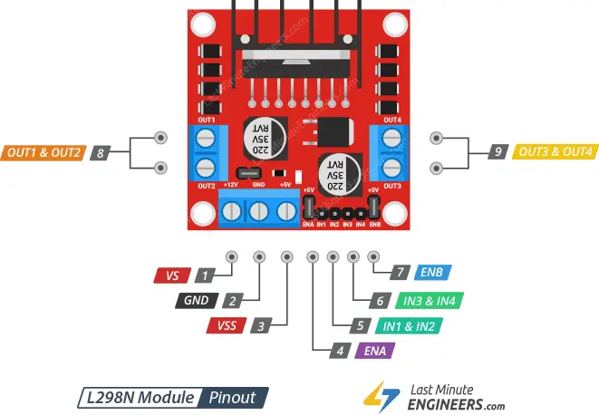

# Wi-Fiラジコンカーを作る

## L298N DCステッパ モータドライバ コントローラ

- ドライバモデル: L298N 2A
- ドライバチップ: ダブルHブリッジL298N
- モーター供給電圧（最大）: 46V
- モーター供給電流（最大）: 2A
- ロジック電圧: 5V
- ドライバ電圧: 5-35V
- ドライバ電流:2A
- 論理電流:0-36mA
- 最大出力（W）: 25W

https://docs.sunfounder.com/projects/3in1-kit/ja/latest/components/component_l298n_module.html

### L298Nのピン配置

| Pin | Description |
| --- | --- |
| VS(+12 power) | DC電源からの12V入力（モータ仕様に合わせて）  |
| GND | グラウンド |
| 5V enable | ジャンパをつなげると、+5 power から出力を行う |
| VSS(+5 power) | 5Vの出力を行う（ESP32への給電・5V enableでON/OFF制御） |
| IN1 & IN2 | モータA回転指示 |
| ENA | モータAの回転数指示（ジャンパ線接続時にはHIGH状態） |
| OUT1 & 2 | モータAへの出力（+/-） |
| IN3 & IN4 | モータB回転指示 |
| ENB | モータBの回転数指示（ジャンパ線接続時にはHIGH状態） |
| OUT3 & 4 | モータBへの出力（+/-） |

### 回転指示のPIN制御

| ENA |　IN1 | IN2 | 回転 |
| --- | --- | --- | --- |
| 1 | HIGH | LOW | 正転 |
| 1 | HIGH | HIGH | ブレーキ |
| 1 | LOW | HIGHT | 逆転 |
| 1 | LOW | LOW | 惰性 |
| 0 | LOW | LOW | 停止 |

### モータ１つを正転させよう

### モータの回転数を変えてみよう

### モータを正転・ブレーキ・逆転・惰性の順で制御してみよう

## 全方向制御

<image src="51v1cEDP8ZL._AC_SY450_.jpg" width="500px">

<image src="Mecanum_wheel_control_principle.svg.png" width="500px">
