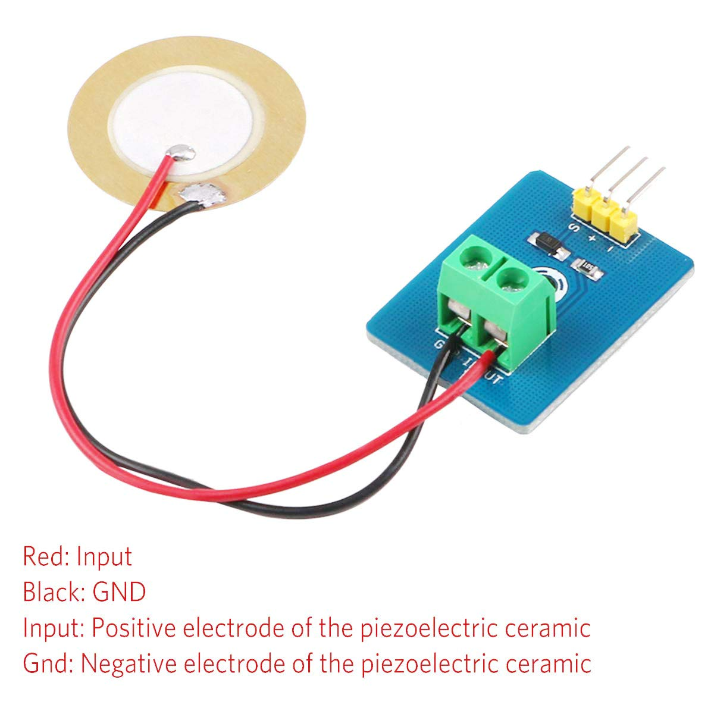

# IoT練習: 10.アナログセンサーを読み込んでみよう

## 本練習の目的

- アナログ値の読込を経験して、取り扱えるセンサーの幅を広げよう
- しきい値を基準にした処理の分岐を経験しよう

## 実装内容

仕様：振動センサーからアナログ値を読み込んで表示しよう



シリアルに分かりやすく振動量を表示する方法を考えてみましょう。

LEDを使った場合にはどのような方法が考えられるでしょうか。

## 以下を実行して結果を確認してみましょう

バーグラフを表示してみよう

```python
import time
import sys
import random


def print_range_bar(
    value, 
    max_value = 100.0, 
    prefix = 'Volume:', 
    suffix = '', 
    length = 50, 
    fill='█', 
    print_end="\r"):
    """
    バーグラフの表示

    Parameters
    ----------
        value : 現在の値
        prefix (str): バーの前に表示する文字列
        suffix (str): バーの後に表示する文字列
        length (int): バーの長さ
        fill (str): バーの中を埋める文字
        print_end (str): 最後に表示する文字列（デフォルトは '\r'）
    """
    # ％の計算
    percent = ("{0:.1f}").format(100 * (value / float(max_value)))
    # バーの長さの計算
    filled_length = int(length * value // max_value)
    # バーの文字列組み立て
    bar = fill * filled_length + '-' * (length - filled_length)
    # 表示
    print(f'{prefix} |{bar}| {percent}% {suffix}', end=print_end)
    
# 乱数で仮にボリュームを定義
volume = 50.0
max_volume = 100.0
while True:
    # 20%変動するとして乱数で処理する。
    change = random.random() * 20.0 - 10.0
    volume += change
    # 上限・下限の処理
    if volume < 0.0:
        volume = 0.0
    elif volume > max_volume:
        volume = max_volume
    # バーグラフの表示
    print_range_bar(volume, max_volume)
    time.sleep(0.1)
```

## ブレッドボードサンプル
